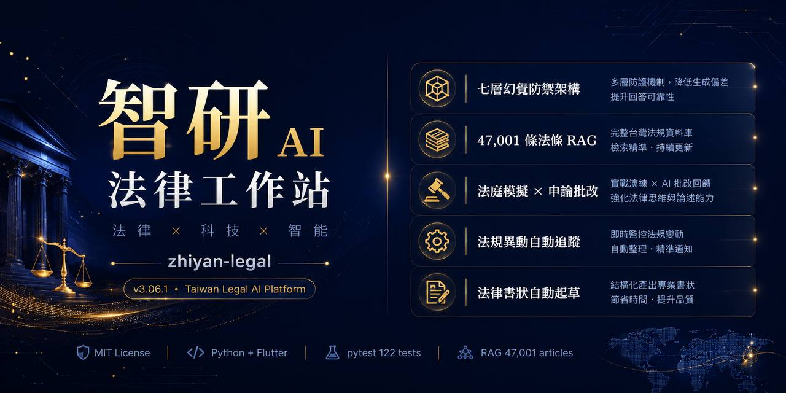

# 智研 AI · Zhiyan Legal AI

[](SKILL.md)
[](docs/)
[](https://lucien-1127.github.io/zhiyan-legal/)
[](.)
[](LICENSE)
[](tests/)

<p align="center">
  
</p>

---

<details open>
<summary><b>🇹🇼 繁體中文</b></summary>

## AI 說的法律，你敢信嗎？

一條捏造的法條，可能讓書狀被退、讓當事人蒙冤。  
AI 的幻覺在其他領域是偶發的麻煩，在法律領域是真實的傷害。

智研是一套開源的台灣法律 AI 研究框架。它的目標不是「讓 AI 回答法律問題」，而是**讓每一個答案都可以被追蹤、被驗證、被質疑**。

---

## 給不同人的一句話

**法律工作者**：你不需要懂 Python。智研可以直接接上 Hermes Agent，幫你做書狀初稿審查、條文速查、判決分析——而且每個答案都有來源可追。

**AI 研究者 / 開源社群**：這是一套可重現的研究框架，每個防禦機制都是可測試的程式碼，不是黑盒子。引用政策、事實閘門、安全路由的實驗數據全部公開。歡迎 fork、複現、挑戰。

**尋找技術合作的人**：如果你有法律資料、平台、或客戶需求，但缺少 AI 後端與系統設計，歡迎直接聯繫。這套框架就是為了可以被整合而設計的。

**想找 AI 解決方案的客戶**：法律 AI 不是買一套 SaaS 就能用的東西。每個場景需要不同的設計。我們提供從研究、架構到部署的完整諮詢，對台灣的法律環境有具體的認識。

---

## 它解決的三個真實問題

**問題一：AI 說的法條，存在嗎？**  
智研的強制引用政策不只要求 AI 列出來源——它會回頭驗證那個來源到底存不存在、說的是不是同一件事。

**問題二：使用者情緒激動時，系統還在硬推法律嗎？**  
當輸入帶有創傷訊號或高風險語句，安全路由會在法律分析之前先介入，把人接住，再繼續。

**問題三：AI 不知道的時候，它會說不知道嗎？**  
事實閘門讓系統在沒有足夠根據時，標示「待查」或「推論」，而不是硬擠一個自信的錯誤答案。

---

## 怎麼開始

**如果你用 Hermes Agent**，直接問就好，系統會自動偵測法律語境：

```
這份合約有哪些風險？
公然侮辱罪的構成要件是什麼？
```

不需要任何前綴。若沒有自動觸發，輸入「智研」強制啟動。

**如果你想在本機跑實驗**：

```bash
git clone https://github.com/Lucien-1127/zhiyan-legal.git
cd zhiyan-legal && bash scripts/setup.sh

PYTHONPATH=src pytest tests/ -v
PYTHONPATH=src python -m zhiyan_legal "什麼是公然侮辱？" --dry-run
```

---

## 想更深入

完整架構、引用政策設計、壓力測試數據，都在 [MkDocs 文件站](https://lucien-1127.github.io/zhiyan-legal/)。  
想合作或有具體需求：[Lucien127@proton.me](mailto:Lucien127@proton.me)

---

## 引用

```bibtex
@software{zhiyan_legal_2026,
  author    = {謝小育 (Lucien127@proton.me)},
  title     = {Zhiyan AI Legal System},
  year      = {2026},
  version   = {v3.07},
  url       = {https://github.com/Lucien-1127/zhiyan-legal}
}
```

**授權：MIT** · 系統輸出為研究人工製品，不構成法律意見。

</details>

---

<details>
<summary><b>🇬🇧 English</b></summary>

## Can You Trust What a Legal AI Says?

A single hallucinated statute can get a brief rejected — or worse, cost someone their freedom.  
For legal AI, hallucination isn't a quality issue. It's real harm.

Zhiyan is an open-source research framework for Taiwan law AI. The goal isn't to answer legal questions. It's to make every answer **traceable, verifiable, and challengeable**.

---

## One Line for Each Audience

**Legal professionals**: You don't need to know Python. Zhiyan integrates with Hermes Agent for document review, statute lookup, and case analysis — with sources you can actually trace.

**AI researchers / open-source community**: Every defense mechanism is testable code, not a black box. Citation policy, fact gate, and safety routing experiments are fully open. Fork it, replicate it, challenge it.

**Looking for a technical collaborator**: If you have legal data, a platform, or client demand but need AI architecture, let's talk. This framework was designed to be integrated.

**Potential clients**: Legal AI isn't a plug-and-play SaaS product. Each context needs its own design. We offer consulting from research to deployment, with concrete knowledge of Taiwan's legal landscape.

---

## Three Real Problems It Solves

**Does the cited statute actually exist?**  
The mandatory citation policy doesn't just require sources — it verifies them.

**Does the system keep pushing legal analysis when someone is in distress?**  
Safety routing intercepts high-risk input before legal analysis begins.

**Does the AI say "I don't know" when it doesn't know?**  
The fact gate flags uncertain outputs as "pending verification" instead of generating a confident wrong answer.

---

## Quickstart

```bash
git clone https://github.com/Lucien-1127/zhiyan-legal.git
cd zhiyan-legal && bash scripts/setup.sh

PYTHONPATH=src pytest tests/ -v
PYTHONPATH=src python -m zhiyan_legal "What is public insult?" --dry-run
```

---

## Go Deeper

Full architecture, citation policy design, and stress test data are at the [MkDocs site](https://lucien-1127.github.io/zhiyan-legal/).  
For collaboration or specific needs: [Lucien127@proton.me](mailto:Lucien127@proton.me)

---

## Citation

```bibtex
@software{zhiyan_legal_2026,
  author    = {Lucien Hsieh (Lucien127@proton.me)},
  title     = {Zhiyan AI Legal System},
  year      = {2026},
  version   = {v3.07},
  url       = {https://github.com/Lucien-1127/zhiyan-legal}
}
```

**License: MIT** · Outputs are research artifacts, not legal advice.

</details>
