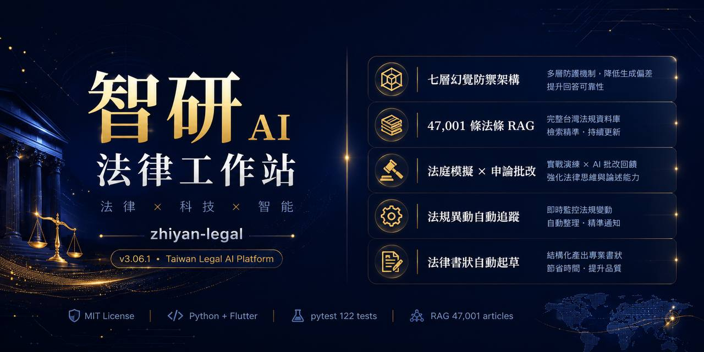

# 智研 AI 法律系統 · Zhiyan AI Legal System
# 智研 AI · Zhiyan Legal AI

[](SKILL.md)
[](docs/)
[](https://lucien-1127.github.io/zhiyan-legal/)
[](docs/wiki/)
[](.)
[](LICENSE)
[](tests/)
[](.github/workflows/)
[](.)
[](LICENSE)
[](tests/)

<p align="center">
  
</p>

---

<details open>
<summary><b>🇹🇼 繁體中文</b></summary>

一條錯誤的法條引用，可能讓當事人失去自由，也可能讓一份書狀被打回。法律 LLM 的幻覺不是技術瑕疵——它是真實的損害。

智研就是為了解決這個問題而生的。它不是另一個包裝成 AI 的法律工具，而是一套可重現的研究框架：把每項防禦機制都寫成可測試的程式碼，用實驗數據證明它到底有沒有用。

## 在研究什麼

三個核心問題貫穿整個系統。

第一，強制引用政策能不能真的減少捏造法條？不是叫 AI 多貼幾個來源標記就好——我們要看的是，那些來源到底存不存在、對不對。

第二，安全優先路由能不能擋住有害輸出？當使用者帶著創傷或怒氣進來，系統能不能在分析法律之前，先把人接住。

第三，事實閘門能不能讓 AI 知道自己什麼時候該說不知道？比起硬擠一個答案，標示「待查」或「推論」反而更重要。

這三題的答案，都寫在每次提交的實驗數據裡。

## 系統怎麼運作

從使用者丟一句話進來，到產出結構化的法律分析，中間經過七層關卡。

最前面是信心檢查——沒有把握的事，系統會直接告訴你它不知道，不硬擠。接著是安全路由，把高風險的發言導入專門的對話處理流程，不再繼續法律分析。

過了安全關之後，核心閘門開始做事：把使用者說的事實分級（哪些是可以追查的、哪些是推測的）、抓出五個關鍵要素（人、事、時、地、果），再判斷案件落在哪個法域。如果是跨域案件，有一套優先序來決定誰是主法域、誰是輔助。

這一層現在還多了兩個新功能：程序階段偵測——確認案件是尚未處理、已報案、已開庭還是已判決——以及一套禁止事項，防止在事實不足時就下結論。

打完基礎後，系統會去查本機端的法條白話資料庫——四萬七千多條，每天同步。遇到爭議性條文，還會用 MCP 協議直接連司法院的判決查詢系統拉真實判決，同時強制檢查憲法法庭的最新見解。

最後，根據使用者的問題類型，系統會選擇適合的模式來回應：是要做品質檢查、法律研究、報告產出，還是出題考試、批改申論、模擬法庭——甚至連寫一篇申論示範答案都行。如果主題不是法律而是科普或商業，還有一個專門的提示詞工程模式，幫你生成客製化的寫手指令。

## 可以怎麼用

如果你用 Hermes Agent，法律相關的問題直接問就好，系統會自動判斷：

```
請分析這個契約有沒有風險
什麼是公然侮辱罪？
```

不需要加任何前綴或指令。如果系統沒有自動觸發，可以說「智研」兩個字來強制啟動。

如果想跑實驗：
## AI 說的法律，你敢信嗎？

一條捏造的法條，可能讓書狀被退、讓當事人蒙冤。  
AI 的幻覺在其他領域是偶發的麻煩，在法律領域是真實的傷害。

智研是一套開源的台灣法律 AI 研究框架。它的目標不是「讓 AI 回答法律問題」，而是**讓每一個答案都可以被追蹤、被驗證、被質疑**。

---

## 給不同人的一句話

**法律工作者**：你不需要懂 Python。智研可以直接接上 Hermes Agent，幫你做書狀初稿審查、條文速查、判決分析——而且每個答案都有來源可追。

**AI 研究者 / 開源社群**：這是一套可重現的研究框架，每個防禦機制都是可測試的程式碼，不是黑盒子。引用政策、事實閘門、安全路由的實驗數據全部公開。歡迎 fork、複現、挑戰。

**尋找技術合作的人**：如果你有法律資料、平台、或客戶需求，但缺少 AI 後端與系統設計，歡迎直接聯繫。這套框架就是為了可以被整合而設計的。

**想找 AI 解決方案的客戶**：法律 AI 不是買一套 SaaS 就能用的東西。每個場景需要不同的設計。我們提供從研究、架構到部署的完整諮詢，對台灣的法律環境有具體的認識。

---

## 它解決的三個真實問題

**問題一：AI 說的法條，存在嗎？**  
智研的強制引用政策不只要求 AI 列出來源——它會回頭驗證那個來源到底存不存在、說的是不是同一件事。

**問題二：使用者情緒激動時，系統還在硬推法律嗎？**  
當輸入帶有創傷訊號或高風險語句，安全路由會在法律分析之前先介入，把人接住，再繼續。

**問題三：AI 不知道的時候，它會說不知道嗎？**  
事實閘門讓系統在沒有足夠根據時，標示「待查」或「推論」，而不是硬擠一個自信的錯誤答案。

---

## 怎麼開始

**如果你用 Hermes Agent**，直接問就好，系統會自動偵測法律語境：

```
這份合約有哪些風險？
公然侮辱罪的構成要件是什麼？
```

不需要任何前綴。若沒有自動觸發，輸入「智研」強制啟動。

**如果你想在本機跑實驗**：

```bash
git clone https://github.com/Lucien-1127/zhiyan-legal.git
cd zhiyan-legal && bash scripts/setup.sh

PYTHONPATH=src pytest tests/ -v
PYTHONPATH=src python -m zhiyan_legal "什麼是公然侮辱？" --dry-run
```

## 想更深入

完整的文件放在 [MkDocs 站台](https://lucien-1127.github.io/zhiyan-legal/)。如果想了解整個架構怎麼設計、引用政策怎麼運作、壓力測試結果如何，那裡有上百份規格文件可以翻。

## 引用

```bibtex
@software{zhiyan_legal_2026,
  author = {謝小育 (Lucien127@proton.me)},
  title = {Zhiyan AI Legal System},
  year = {2026},
  version = {v3.07},
  url = {https://github.com/Lucien-1127/zhiyan-legal}
}
```

## 授權

MIT。系統輸出為研究人工製品，不構成法律意見。
---

## 想更深入

完整架構、引用政策設計、壓力測試數據，都在 [MkDocs 文件站](https://lucien-1127.github.io/zhiyan-legal/)。  
想合作或有具體需求：[Lucien127@proton.me](mailto:Lucien127@proton.me)

---

## 引用

```bibtex
@software{zhiyan_legal_2026,
  author    = {謝小育 (Lucien127@proton.me)},
  title     = {Zhiyan AI Legal System},
  year      = {2026},
  version   = {v3.07},
  url       = {https://github.com/Lucien-1127/zhiyan-legal}
}
```

**授權：MIT** · 系統輸出為研究人工製品，不構成法律意見。

</details>

---

<details>
<summary><b>🇬🇧 English</b></summary>

A single hallucinated legal citation can cost someone their freedom or get a brief rejected. For legal LLMs, hallucination isn't a quality issue — it's real harm.

Zhiyan was built to address that. It's not another AI wrapper for legal tasks. It's a reproducible research framework where every defense mechanism is written as testable code, backed by experimental data.

## Research Questions

Three questions drive the system.

First, does a mandatory citation policy actually reduce fabricated statutes? Not just formatting citations — verifying whether those citations exist.

Second, does priority safety routing reduce harmful outputs? When someone brings trauma or anger into a conversation, can the system respond to the human before analyzing the law?

Third, does a fact gate improve how AI calibrates uncertainty? Knowing when to say "this needs verification" matters more than forcing an answer.

## Architecture

Input passes through seven layers before producing a structured legal analysis.

A confidence gate comes first — if the system can't answer, it says so. Then safety routing diverts high-risk input to specialized handling.

The core gate classifies facts (verifiable vs.推测), extracts five elements (who, when, where, what, result), and determines jurisdiction. For cross-domain cases, a priority chain decides which domain leads. Program stage detection checks whether the case is pending, filed, in trial, or已判決.

From there, a local RAG database of 47,001 statute plain-language entries is queried. For contested provisions, the system connects directly to Taiwan's judicial judgment database via MCP protocol, with mandatory constitutional court checks for fundamental rights cases.

Finally, the mode router selects the right response pattern: QC, research, report, essay grading, moot court, or even generating a custom writing prompt for non-legal topics.
## Can You Trust What a Legal AI Says?

A single hallucinated statute can get a brief rejected — or worse, cost someone their freedom.  
For legal AI, hallucination isn't a quality issue. It's real harm.

Zhiyan is an open-source research framework for Taiwan law AI. The goal isn't to answer legal questions. It's to make every answer **traceable, verifiable, and challengeable**.

---

## One Line for Each Audience

**Legal professionals**: You don't need to know Python. Zhiyan integrates with Hermes Agent for document review, statute lookup, and case analysis — with sources you can actually trace.

**AI researchers / open-source community**: Every defense mechanism is testable code, not a black box. Citation policy, fact gate, and safety routing experiments are fully open. Fork it, replicate it, challenge it.

**Looking for a technical collaborator**: If you have legal data, a platform, or client demand but need AI architecture, let's talk. This framework was designed to be integrated.

**Potential clients**: Legal AI isn't a plug-and-play SaaS product. Each context needs its own design. We offer consulting from research to deployment, with concrete knowledge of Taiwan's legal landscape.

---

## Three Real Problems It Solves

**Does the cited statute actually exist?**  
The mandatory citation policy doesn't just require sources — it verifies them.

**Does the system keep pushing legal analysis when someone is in distress?**  
Safety routing intercepts high-risk input before legal analysis begins.

**Does the AI say "I don't know" when it doesn't know?**  
The fact gate flags uncertain outputs as "pending verification" instead of generating a confident wrong answer.

---

## Quickstart

```bash
git clone https://github.com/Lucien-1127/zhiyan-legal.git
cd zhiyan-legal && bash scripts/setup.sh

PYTHONPATH=src pytest tests/ -v
PYTHONPATH=src python -m zhiyan_legal "What is public insult?" --dry-run
```

---

## Go Deeper

Full architecture, citation policy design, and stress test data are at the [MkDocs site](https://lucien-1127.github.io/zhiyan-legal/).  
For collaboration or specific needs: [Lucien127@proton.me](mailto:Lucien127@proton.me)

---

## Citation

```bibtex
@software{zhiyan_legal_2026,
  author = {謝小育 (Lucien127@proton.me)},
  title = {Zhiyan AI Legal System},
  year = {2026},
  version = {v3.07},
  url = {https://github.com/Lucien-1127/zhiyan-legal}
}
```

## License

MIT. Outputs are research artifacts, not legal advice.

  author    = {Lucien Hsieh (Lucien127@proton.me)},
  title     = {Zhiyan AI Legal System},
  year      = {2026},
  version   = {v3.07},
  url       = {https://github.com/Lucien-1127/zhiyan-legal}
}
```

**License: MIT** · Outputs are research artifacts, not legal advice.

</details>
