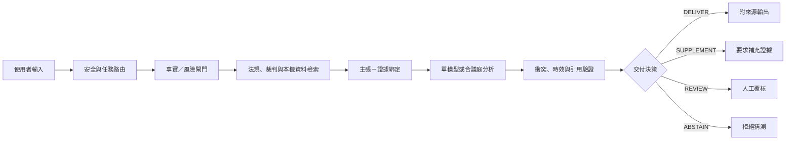

# 智研 AI 法律系統 · Zhiyan Legal AI

<p align="center">
  
</p>

<p align="center">
  <strong>讓法律 AI 的回答可以被追蹤、驗證與質疑。</strong><br>
  A reproducible Taiwan-law research framework for citation grounding, uncertainty gates, safety routing, and multi-model review.
</p>

<p align="center">
  <a href="https://github.com/Lucien-1127/zhiyan-legal/actions/workflows/test.yml"></a>
  <a href="https://lucien-1127.github.io/zhiyan-legal/"></a>
  <a href="https://www.python.org/"></a>
  <a href="LICENSE"></a>
  <a href="CITATION.cff"></a>
</p>

> [!IMPORTANT]
> 智研是研究與工程框架，不是律師服務，也不保證模型輸出正確。涉及個案權益時，請核對最新法源並諮詢合格專業人士。

## 為什麼做智研

法律 LLM 的問題不只是「回答得像不像」，而是：

- 引用的法條或判決是否真的存在？
- 來源是否直接支持相鄰主張？
- 事實不足時，系統是否願意標示「待查」而不是猜測？
- 高風險輸入是否先進入安全流程，而不是繼續產生法律策略？
- 不同模型同意時，究竟是獨立驗證，還是共享同一個錯誤前提？

智研將這些問題落成可測試的路由、資料結構、驗證閘門與實驗管線，而不是只依賴一段大型提示詞。

## 核心能力

| 能力 | 用途 | 可檢查的位置 |
| --- | --- | --- |
| 引用接地與證據綁定 | 將主張連回來源，檢查引用存在性與支援關係 | `src/zhiyan_legal/verification/` |
| 事實與決策閘門 | 區分可交付、需補證據、需人工覆核或拒絕 | `src/zhiyan_legal/pipeline/`、`src/zhiyan_legal/domain/` |
| 安全優先路由 | 高風險語句先進入安全處理 | `src/zhiyan_legal/router.py` |
| 多代理／多模型合議庭 | 保留分歧、盲點與少數意見，不以投票取代證據 | `src/zhiyan_legal/committee/`、`committee/` |
| 台灣法律研究工具 | 法規、裁判與時效性檢查介面 | `src/zhiyan_legal/tools/`、`src/zhiyan_legal/verification/temporal.py` |
| 可重現實驗 | 對引用政策、安全路由與委員會機制進行消融測試 | `benchmark/`、`tests/`、`RESEARCH.md` |
| Hermes Agent 技能 | 將研究規則作為可載入技能使用 | `skills/zhiyan-legal/`、`SKILL.md` |

## 60 秒無成本試跑

Dry run 不會呼叫外部模型 API。

```bash
git clone https://github.com/Lucien-1127/zhiyan-legal.git
cd zhiyan-legal
bash scripts/setup.sh

source .venv/bin/activate
zhiyan-legal "什麼是公然侮辱罪？" --dry-run
zhiyan-legal --list-tasks
```

`setup.sh` 會建立 `.venv`、以 editable mode 安裝套件、建立本機 `.env` 範本，並執行一次 dry-run 冒煙測試。

## 開發者安裝

```bash
git clone https://github.com/Lucien-1127/zhiyan-legal.git
cd zhiyan-legal
python3 -m venv .venv
source .venv/bin/activate
python -m pip install --upgrade pip
python -m pip install -e ".[test]"

python -m pytest tests/ --tb=short \
  --ignore=tests/test_c54_validation.py \
  --ignore=tests/run_ablation_v8_committee.py \
  -m "not integration"
```

需要額外功能時安裝對應 extra：

```bash
python -m pip install -e ".[committee]"  # 多模型委員會
python -m pip install -e ".[api]"        # FastAPI 介面
python -m pip install -e ".[docgen]"     # DOCX 文件產生
python -m pip install -e ".[all]"        # 全部功能與測試工具
```

## CLI 使用

```bash
# 不呼叫 API；只檢查路由、載入文件與提示詞組合
zhiyan-legal "查台灣近期 deepfake 立法" --dry-run

# 強制指定研究路由
zhiyan-legal "比較兩份法規" --task RESEARCH --dry-run

# 取得可供程式處理的資訊
zhiyan-legal "測試查詢" --dry-run --output json
```

真正呼叫模型前，請複製並編輯 `.env.example`；不要把 API key 提交到 Git。

## 系統流程


```mermaid
flowchart LR
    A[使用者輸入] --> B[安全與任務路由]
    B --> C[事實／風險閘門]
    C --> D[法規、裁判與本機資料檢索]
    D --> E[主張－證據綁定]
    E --> F[單模型或合議庭分析]
    F --> G[衝突、時效與引用驗證]
    G --> H{交付決策}
    H -->|DELIVER| I[附來源輸出]
    H -->|SUPPLEMENT| J[要求補充證據]
    H -->|REVIEW| K[人工覆核]
    H -->|ABSTAIN| L[拒絕猜測]
```

詳細架構：[Documentation](https://lucien-1127.github.io/zhiyan-legal/) · [RESEARCH.md](RESEARCH.md) · [docs/architecture.md](docs/architecture.md)

## 可重現性與研究邊界

本儲藏庫公開測試、研究設計與實驗腳本，但「有測試」不代表「法律答案永遠正確」。評估結果必須連同以下資訊一起閱讀：

- 使用的資料集、模型、版本與時間範圍
- 是否為 dry-run、mock、離線測試或真實 API 執行
- 引用格式合規與引用內容正確是兩種不同指標
- 多模型共識不等於多來源證據
- 台灣法以外的結論不能直接外推

研究問題、方法與限制詳見 [RESEARCH.md](RESEARCH.md)。歷史變更詳見 [CHANGELOG.md](CHANGELOG.md)。

## 儲藏庫導覽

```text
src/zhiyan_legal/   可安裝的 Python 核心套件
skills/             Hermes Agent 技能封裝
committee/          合議庭與辯論實驗
benchmark/          評估與 benchmark 資產
tests/              單元、契約、管線與整合測試
docs/               MkDocs 規格與研究文件
results/             已提交的研究產物
```

## 參與開發

歡迎以下貢獻：

- 提供可公開、可驗證且不含個資的台灣法律測試案例
- 重現消融實驗並回報環境、模型與完整設定
- 修正法規時效、引用定位、路由與測試問題
- 改善安裝、文件、CLI 與 API 的開發者體驗
- 以 issue 描述失敗案例，而不只貼模型回答截圖

開始前請讀 [CONTRIBUTING.md](CONTRIBUTING.md)、[Security Policy](SECURITY.md) 與現有 [Issues](https://github.com/Lucien-1127/zhiyan-legal/issues)。

## 專案狀態

目前為 Beta 研究框架。適合重現、評估、整合與審查；尚不應被描述為可無人監督提供法律意見的成品。

## 引用

```bibtex
@software{zhiyan_legal_2026,
  author  = {Lucien Hsieh},
  title   = {Zhiyan AI Legal System},
  year    = {2026},
  version = {3.7.2},
  url     = {https://github.com/Lucien-1127/zhiyan-legal}
}
```

機器可讀引用資料見 [CITATION.cff](CITATION.cff)。

## English summary

Zhiyan is an open-source research framework for building and evaluating citation-grounded Taiwan-law assistants. It focuses on claim-evidence binding, uncertainty and safety gates, temporal verification, and multi-agent or multi-model review.

Start without an API key:

```bash
bash scripts/setup.sh
source .venv/bin/activate
zhiyan-legal "What are the elements of public insult in Taiwan?" --dry-run
```

The project is in beta and is not a substitute for legal advice. See the [documentation](https://lucien-1127.github.io/zhiyan-legal/), [research protocol](RESEARCH.md), and [contribution guide](CONTRIBUTING.md).

## License

[MIT](LICENSE) © Lucien
