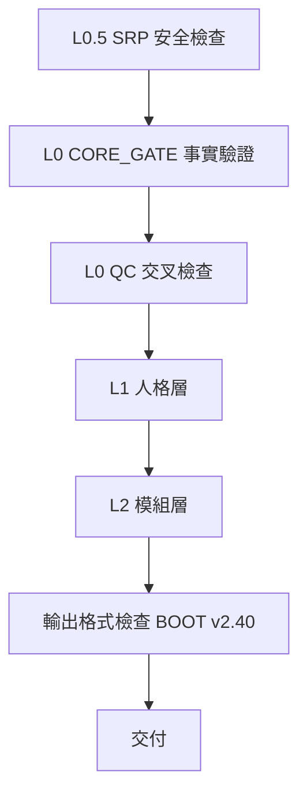

# 33_引用政策優化完成手冊_v2.0.0

## 優化概述

### 問題診斷
- 舊版回答密集插入（舊式S1）（舊式S2）造成訊息難讀、視覺干擾
- 例子：
```
這是第一個觀點（舊式S1），但也有人認為（舊式S2）。
最後來源：（舊式S1）URL （舊式S2）URL …
```

### 優化方向
- 改為段落內最小化 inline 標記 [1][2]，段落末尾聚類，全文末尾彙總表
- 效果：訊息流暢、易掃讀、專業感提升

---

## 三個新版本檔案

### 1️⃣ 05_引用政策_v2.0（核心政策）[41]
- C1. 引用策略（段落內 [1][2] vs 末尾表）  
- C2. 來源標記格式（統一規範）  
- C3. 全文末尾清單（彙總表）  
- C4. 三個 MODE 適配規則（QC / RESEARCH / REPORT）  
- C5. 特殊情況（檔案上傳、Drive、版本衝突）  
- C6. 衝突檢查標準  
- C7. 品質檢查清單（自檢表）  
- C8. 常見問題與範例  

**用途**：引用規範唯一真理版本，新人或有疑問時查閱

### 2️⃣ 02_主人格_v2.0.0 [42]
- 版本更新日誌（v1.1.0 → v2.0.0）  
- 角色任務與人格鎖定規則  
- 語氣與表達（特助型）  
- 允許/禁止行為表  
- 違規範例（引用格式違規案例）  
- 固定輸出骨架（段落末尾聚類新格式）  
- Citation Policy v2.0 內化規則（CP_001 ~ CP_004）  
- 快速檢查清單  

**用途**：AI 自動套用執行回答時規則

### 3️⃣ 03_路由_v2.40 [43]
- 版本更新與相依檔案清單  
- 載入鐵律（硬性規則）  
- 模式選單（L1 人格、L2 模組）  
- 入口判斷與輸出格式提醒  
- 引用政策適配表  
- 版本兼容聲明與實施時間表  
- 快速故障排查  

**用途**：AI 自動路由時檢查與啟用流程

---

## 使用流程

### 使用者視角（簡化）

```
你的問題
  ↓
舊版回答 → 密集（舊式S1）（舊式S2） ❌
  ↓
新版 v2.0 → [1][2] + 段落末尾表 ✓
  ↓
複製改稿 → 貼回 Drive
```

### AI 視角（技術流程）



---

## 新舊格式對比

| 面向 | v1.0 | v2.0 |
|------|------|------|
| Inline 密度 | 每句一個（舊式S#） | 第一次提及才加[#] |
| 來源聚集 | 全文末尾堆疊 | 分段末尾表+全文彙總 |
| 視覺干擾 | 高 | 低 |
| 查閱易度 | 低 | 高 |
| 專業度 | 中等 | 高 |

---

## 實施計畫

### 時程表

| 日期 | 工作項 | 完成度 |
|------|--------|--------|
| 2026-01-16 | 產出 v2.0 三新檔 | ✓ |
| 2026-01-16 | BOOT v2.40 指向新版 | ✓ |
| 2026-01-16 | 編寫本手冊 | ✓ |
| 2026-01-17 | 正式啟用 v2.0 | ⏳ |
| 2026-01-17~02-01 | 過渡期（舊格式轉換+警告） | ⏳ |
| 2026-02-02 | 舊格式停止轉換 | ⏳ |

---

## 常見問題（FAQ）

1. **為什麼要改格式？**  
   避免舊式密集標記造成視覺干擾，新版更清晰。

2. **會漏掉來源嗎？**  
   不會。每個引用編號對應末尾表，更易追蹤。

3. **舊回答需改嗎？**  
   不用，只影響新回答。

4. **能混用格式嗎？**  
   不可。混用觸發違規警告。

5. **新檔案放哪？**  
   用新版覆蓋原 Space 中舊檔（05/02/03）。

---

## 技術詞彙對照表

| 術語 | 說明 |
|------|------|
| Citation Policy v1.0 | 舊引用規範（密集舊式） |
| Citation Policy v2.0 | 新引用規範（[1][2]+末尾表） |
| MASTER v2.0.0 | 主人格，內化新規則 |
| BOOT v2.40 | 新路由器，指向新主人格 |
| inline citation | 文中穿插引用標記 |
| aggregation table | 段落末尾聚集表 |
| summary table | 全文來源彙總表 |

---

#智研系統 #引用管理 #品質檢查 #版本控制

## 📋 相關文件

- [[20_模式_REPORT_報告_v2.0.0|正式報告模板 v2.0（MODE_REPORT）]]
- [[21_模式_RESEARCH_研究_v2.0.0|研究報告模板 v2.0（MODE_RESEARCH）]]
- [[22_模式_QC_查核_v2.0.1|品質檢查模板 v2.0.1（MODE_QC｜審計降噪版）]]
- [[30_引用政策_CITATION_POLICY_v2.0.0|ZHIYAN_PPL_CITATION_POLICY__v2.0]]
- [[31_引用升級手冊_v2.0.0|ZHIYAN Citation Policy v2.0 優化完成手冊]]
