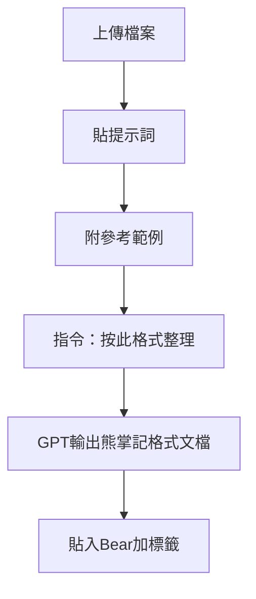

# 83_品質檢查模板_v2.0.1_reference

## 核心資訊

| 項目 | 內容 |
|------|------|
| 版本 | v2.0.1（對齊 Space v3.00.2） |
| 日期 | 2026-01-17 |
| 適用 | 檢查內容正確性、找出漏洞、交叉驗證事實 |
| 區塊結構 | 預設五區塊 + 第3區可選 |

---

## 用途

- 抓錯（格式、邏輯、規格不一致）  
- 對齊規範（引用、版本、輸出骨架）  
- 找矛盾（同專案內多份文件互相衝突）  

**降噪原則**  
- 不強制程式碼框  
- [[衝突檢查]] 僅在口徑不一致或使用者要求時輸出

---

## 固定回答結構

### 1) 核心結論
- 1～3 句描述  
- 若有問題：列前 3 個最可能造成錯誤輸出的點

### 2) 依據（含修補清單）

**檢查基準**  
- 遵循哪些規格/政策/核心檔案

**發現**  
- 逐點列出問題（1 句說明哪裡不對）

**建議改正清單**（範本）

| 問題 | 影響 | 建議 | 驗證方式 |
|------|------|------|----------|
| … | … | … | … |
| … | … | … | … |

---

### 3) 衝突檢查（可選）

- 結論：未檢出 / 檢出衝突  
- 衝突點：A 說 X；B 說 Y  
- 影響：可能導致輸出格式不一致或引用編號混亂  
- 可信版本：以某檔為準或【待查】

---

### 4) 風險與邊界

- 僅提醒最可能被誤用或誤讀的一點

---

### 5) 來源

僅列本次實際使用的來源：
- [#] 標題或檔名 — [[Upload_檔名|Upload:檔名]]

---

## 快速提示

- QC 首要目的是移除互撞規則，降低模型誤解  
- [[Space指令]] 與 [[Persona骨架]] 衝突時，以 Space 指令為準

---

## GPT使用流程

---

#智研系統 #品質檢查 #審計 #文檔整理

## 📋 相關文件

- [[80_啟動流程_BOOT_v2.40.0_引用政策更新版_deprecated|80_啟動流程_BOOT_v2.40.0_引用政策更新版_deprecated]]
- [[81_空間核心規格_PPL_SPACE_CORE_v3.0.0_reference|ZHIYAN_PPL_SPACE_CORE_v3.00_HYBRID]]
- [[82_空間核心規格_融合版_v3.0.0_deprecated|82_空間核心規格_融合版_v3.0.0_deprecated]]
- [[84_引用政策_簡版_v2.0.0_deprecated|84_引用政策_簡版_v2.0.0_deprecated]]
- [[85_系統架構全文_v1.3_reference|💡 Legal AI System v1.3 架構]]
