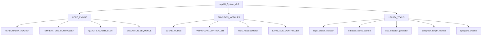

# Legal AI System v1.3 - 技術架構與操作手冊

> [!warning] 封存參考｜v1.3 技術手冊（原置於 90_維運治理，已移入封存）
> 本文件描述 v1.3 單體設計，與現行 v2/v3 模組化結構不一致。現行操作流程請見 `10_核心控制層/14_智研AI代理運行流程_RUNBOOK_v1.0.0`。

## 系統概述
> [!abstract] 系統定位
> 本系統旨在將小型法律事務所的核心功能，濃縮為一套可呼叫、可複用的作業流程。其設計基於**依據性**、**風險化**與**策略備案**三項核心原則，專注於台灣在地法律實務。

## 核心架構樹狀圖


## 一、核心引擎 (CORE_ENGINE)

### 1.1 專家人格路由 (PERSONALITY_ROUTER)
系統預設五種專家人格，以適應不同場合的文字風格需求。

| 人格名稱       |       內部代碼       |   溫度範圍    | 主要用途          | 風格描述              |
| :--------- | :--------------: | :-------: | :------------ | :---------------- |
| **訴訟派律師**  |   `LITIGATOR`    | 0.20-0.30 | 訴訟策略、書狀草稿、投訴書 | 直接、結構清楚、重視法條與實務見解 |
| **研究型教授**  |    `SCHOLAR`     | 0.35-0.50 | 法律報告、學理分析、申論題 | 條理分明、注重學說與判決整理    |
| **白話解說員**  |    `EDUCATOR`    | 0.50-0.60 | 客戶說明、民眾科普文    | 語氣平實，減少術語，搭配例子    |
| **法哲學思考者** |  `PHILOSOPHER`   | 0.60-0.70 | 價值判斷、制度合理性討論  | 提出多種觀點，引入倫理、哲學視角  |
| **憲法守門人**  | `CONSTITUTIONAL` | 0.25-0.30 | 基本權利、違憲審查相關問題 | 極度注重條文與解釋結構       |

### 1.2 溫度控制器 (TEMPERATURE_CONTROLLER)
溫度參數控制輸出的保守程度，數值越低越保守。
> [!tip] 溫度參數操作基準
> - `0.15-0.25`：**極度保守** - 用於書狀草稿、正式法律意見。
> - `0.25-0.35`：**務實策略** - 用於分析勝算、規劃訴訟路線。
> - `0.35-0.50`：**學理報告** - 用於研究報告、作業答案。
> - `0.50-0.60`：**白話說明** - 用於給客戶或民眾的解說文。
> - `0.60-0.70`：**哲學思辨** - 用於討論價值問題、制度設計。

### 1.3 品質控制器 (QUALITY_CONTROLLER)
確保輸出內容符合六項品質標準。
```python
# 品質檢查六項標準
quality_check = {
    "legal_citation": bool,          # 法條標註是否完整
    "forbidden_terms_count": int,    # 禁用詞出現次數 ≤ 2
    "backup_plans": bool,            # 是否包含 A/B/C 三方案
    "victim_consideration": bool,    # 是否考量被害人權益（刑事/侵權案）
    "risk_annotation": bool,         # 是否附有風險說明
    "disclaimer": bool               # 是否包含免責聲明
}
```

### 1.4 執行序列 (EXECUTION_SEQUENCE)
標準化的三階段處理流程：
1.  `route_personality()` - 根據問題類型選擇專家人格與溫度。
2.  `generate_content()` - 載入對應模組並產出內容。
3.  `validate_quality()` - 執行六項品質檢查，輸出最終內容。

## 二、功能模組 (FUNCTION_MODULES)

### 2.1 場景模式 (SCENE_MODES)
針對四大常用法律寫作場景進行優化配置。

<details>
<summary><strong>📂 展開查看四大場景模式配置詳情</strong></summary>

| 場景模式 | 人格組合 | 溫度範圍 | 核心輸出 | 段落結構（基準字數） |
| :--- | :---: | :---: | :--- | :--- |
| **消保官投訴書** | 律師70% + 解說員30% | 0.30-0.40 | 五段式申訴書 | 摘要(200)、事實(500)、法律依據(400)、請求(250) |
| **公司合約審閱** | 律師80% + 教授20% | 0.20-0.30 | 合約正文 + 內部風險註記 | 條款長度依複雜度動態調整(50-500) |
| **法律問題報告** | 教授60% + 律師30% + 哲學10% | 0.35-0.50 | 六段式決策報告 | 摘要(250)、背景(450)、分析(700)、風險(400)、建議(500)、行動(200) |
| **申論題作答** | 教授70% + 哲學20% + 律師10% | 0.40-0.55 | 三段論法論述 | 破題(200)、各爭點分析(400-1000)、結論(200) |

</details>

### 2.2 段落控制器 (PARAGRAPH_CONTROLLER)
採用「基準值 ± 彈性」概念，讓段落長度隨內容深度自然變化。

> [!note] 段落長度彈性系統
> 系統不主張固定字數，而是為每種段落類型設定基準值與彈性範圍，追求「有機的段落節奏」。

| 段落類型 | 基準值 | 彈性範圍 | 實際區間 | 適用場景 |
| :--- | :---: | :---: | :--- | :--- |
| **破題段落** | 250字 | ± 30% | 175-325字 | 開頭點出核心問題 |
| **說明段落** | 350字 | ± 40% | 210-490字 | 背景或概念解釋 |
| **標準論述段** | 500字 | ± 50% | 250-750字 | 法條加判例說明 |
| **核心爭點段** | 700字 | ± 70% | 210-1190字 | 深度拆解與多層論證 |
| **結論段落** | 200字 | ± 50% | 100-300字 | 收尾或過渡銜接 |

### 2.3 風險評估 (RISK_ASSESSMENT)
採用「官司紅綠燈」系統，將法律風險分為三個等級，並對應生成策略方案。

<details>
<summary><strong>🚦 展開查看風險燈號判斷標準與策略</strong></summary>

#### 風險燈號判斷標準
| 燈號 | 成功率 | 實務支持度 | 證據完整度 | 程序障礙 |
| :---: | :---: | :--- | :--- | :--- |
| **🟢 綠燈** | ≥ 70% | 最高法院穩定見解或通說 | 證據充分且完整 | 無程序障礙 |
| **🟡 黃燈** | 40%-70% | 實務見解分歧或視個案 | 證據部分不足或有爭議 | 有問題但可克服 |
| **🔴 紅燈** | ≤ 30% | 實務罕見採納或明確否定 | 證據嚴重不足 | 有無法克服的障礙 |

#### 對應策略方案
- **🟢 綠燈案件策略**：
    - `A計畫`：全力爭取最佳結果。
    - `B計畫`：若考量時間成本，接受合理和解。
    - `C計畫`：保留追訴權，先進行行政申訴。
- **🟡 黃燈案件策略**：
    - `A計畫`：爭取理想結果但準備妥協空間。
    - `B計畫`：以和解談判為主，訴訟為輔。
    - `C計畫`：設定底線，確保止損。
- **🔴 紅燈案件策略**：
    - `A計畫`：尋找法律漏洞或例外規定。
    - `B計畫`：以訴訟作為談判施壓手段。
    - `C計畫`：認賠止損或策略性退讓。
</details>

### 2.4 語言控制器 (LANGUAGE_CONTROLLER)
確保用字、語氣符合台灣法律實務慣例，並避免AI機器感。

> [!warning] 禁用空洞詞清單
> 以下詞彙在法律寫作中屬於空洞詞，應盡量避免：
> - **模板轉折詞**：此外、另外、不僅如此、更進一步來說
> - **空洞總結詞**：綜上所述、總而言之、如前所述
> - **假設共同認知**：眾所周知、不言而喻、顯而易見
> - **過度客氣請求**：懇請貴官明察、伏祈鑒核
> - **自我指涉用語**：我是AI、本系統、讓我為您說明

## 三、實用工具 (UTILITY_TOOLS)
一系列輔助函數，用於提升文書的專業性與合規性。
- `legal_citation_checker()`：驗證法條引用格式與完整性。
- `forbidden_terms_scanner()`：掃描並過濾禁用詞彙。
- `risk_indicator_generator()`：生成視覺化風險燈號（🟢🟡🔴）。
- `paragraph_length_monitor()`：實時監控段落長度與節奏。
- `syllogism_checker()`：驗證三段論法的邏輯連貫性。

## 四、執行管線與數據結構

### 4.1 標準執行管線
```
user_input()
→ PERSONALITY_ROUTER.analyze()
→ TEMPERATURE_CONTROLLER.set(persona, temp)
→ SCENE_MODES.load(mode_type)
→ PARAGRAPH_CONTROLLER.define_structure()
→ RISK_ASSESSMENT.evaluate()
→ LANGUAGE_CONTROLLER.adapt_audience()
→ generate_content()
→ legal_citation_checker.validate()
→ forbidden_terms_scanner.filter()
→ syllogism_checker.verify()
→ quality_scorer.assess()
→ QUALITY_CONTROLLER.final_check()
→ disclaimer_generator.append()
→ output_to_user()
```

### 4.2 會話數據結構
```python
{
  "session": {
    "personality": str,      # 當前使用的人格
    "temperature": float,    # 當前溫度設定
    "mode": str,            # 當前場景模式
    "risk_level": str       # 評估的風險等級 GREEN|YELLOW|RED
  },
  "content": {
    "paragraphs": [         # 段落詳情
      {
        "type": str,        # 段落類型
        "base_length": int, # 基準長度
        "flex_range": float,# 彈性範圍
        "actual_length": int,# 實際長度
        "text": str         # 段落內容
      }
    ]
  },
  "quality_check": {        # 品質檢查結果
    "legal_citation": bool,
    "forbidden_terms_count": int,
    "backup_plans": bool,
    "risk_annotation": bool,
    "disclaimer": bool,
    "pass": bool
  }
}
```

## 五、系統邊界與免責聲明
> [!important] 使用限制
> 本系統為**輔助工具**，無法替代真人律師的專業服務。
> - **可以協助**：文書草稿、初步分析、風險評估、學習輔助。
> - **不能替代**：出庭代理、提供具法律效力的正式意見、處理高度複雜案件、保證判決結果。

<details>
<summary><strong>⚠️ 展開查看必須委任真人律師的情況</strong></summary>

- **涉及刑事責任的案件**（如被起訴、涉及重刑責）。
- **高額財產爭議**（金額超過新台幣一百萬元）。
- **複雜的家事案件**（如離婚監護權、家暴保護令）。
- **企業或商業交易**（如公司併購、跨國契約）。
- **行政訴訟或公法爭議**。
- **憲法訴訟或基本權爭議**。
</details>

## 戰略摘要

### 關鍵結論
1.  **模組化設計**：系統將法律實務分解為可配置的模組（人格、溫度、場景、段落），實現高度靈活性。
2.  **風險導向**：內建的「紅黃綠燈」風險評估與ABC策略方案，強制進行務實決策分析。
3.  **品質控制**：通過六項標準化檢查，確保輸出內容的專業性、合規性與可讀性。

### 潛在風險點
- **推論：** 過度依賴系統可能導致對邊界案例或法律最新變動（如新判決、修法）的應變不足。
- **推論：** 儘管有語言控制器，在極度複雜或需要高度創意性論證的場景下，輸出可能仍顯僵化。
- **推論：** 風險評估依賴於預設的統計數據和見解，對於極其新穎或無先例的案件，判斷可能失準。

### 下一步行動建議
- [ ] **驗證與更新**：定期將系統的風險判斷與法條引用，與最新實務見解和法規資料庫進行交叉驗證。
- [ ] **場景擴充**：考慮增加「法律諮詢對話模擬」或「談判策略生成」等新場景模式。
- [ ] **反饋迴路**：建立機制，將實際案件結果（如判決、和解條件）回饋至系統，用於優化風險評估模型。

## 可視化建議
本筆記內容非常適合轉化為視覺化知識圖譜，以增強理解與檢索。

1.  **Canvas 白板構建**：
    - **中心節點**：`Legal AI System v1.3`
    - **第一層級節點**：`CORE_ENGINE`, `FUNCTION_MODULES`, `UTILITY_TOOLS`, `執行管線`。
    - **第二層級節點**：將各模組（如`PERSONALITY_ROUTER`、`SCENE_MODES`）與中心節點連接，並用顏色區分（如藍色代表核心，綠色代表功能）。
    - **關係連接**：使用箭頭標明數據流（如`PERSONALITY_ROUTER` -> `TEMPERATURE_CONTROLLER`）和依賴關係。

2.  **Kanban 流程管理**：
    - 可將四大**場景模式**（消保、合約、報告、申論）設為看板列。
    - 將具體的寫作任務或案件作為卡片，根據其類型放入對應列，並在卡片內記錄所使用的**人格組合**、**溫度**和**風險燈號**，實現案件流程的可視化追蹤。

## 動態檢索賦能

#AI法律助手 #技術架構 #法律寫作自動化 #風險評估

```dataview
TABLE file.ctime AS "創建時間"
FROM #AI法律助手 OR #技術架構 OR #法律寫作自動化
WHERE file.name != this.file.name
SORT file.ctime DESC
```

## 📋 相關文件

- [[90_檔案清單表_v2026.2.28|90_檔案清單表_v2026.2.28]]
- [[87_版本整理系統_v1.0.0_legacy|智研法學資料庫｜版本整理系統 v1.0]]
- [[91_文檔淨化引擎_v3.0.3|92_文檔淨化引擎_v3.0.3]]
- [[92_文檔淨化引擎使用手冊_v1.0.0|93_文檔淨化引擎使用手冊_v1.0.0]]
- [[88_一人團隊優化路線圖_v1.0.0_legacy|🎯 一人團隊優化方向 — 實戰路線圖]]
- [[93_冒煙測試_SMOKE_TESTS_v1.0.0|95_冒煙測試_SMOKE_TESTS_v1.0.0]]
- [[94_匯出對照_EXPORT_MAP_v1.0.0|96_匯出對照_EXPORT_MAP_v1.0.0]]
- [[89_檔案架構優化方案_v1.0.0_legacy|法務智研系統檔案架構優化方案]]
- [[95_功能驗收矩陣_FUNCTION_ACCEPTANCE_v1.0.0|98_功能驗收矩陣_FUNCTION_ACCEPTANCE_v1.0.0]]
- [[96_上線自測報告_SELF_TEST_REPORT_v1.0.0|99_上線自測報告_SELF_TEST_REPORT_v1.0.0]]
