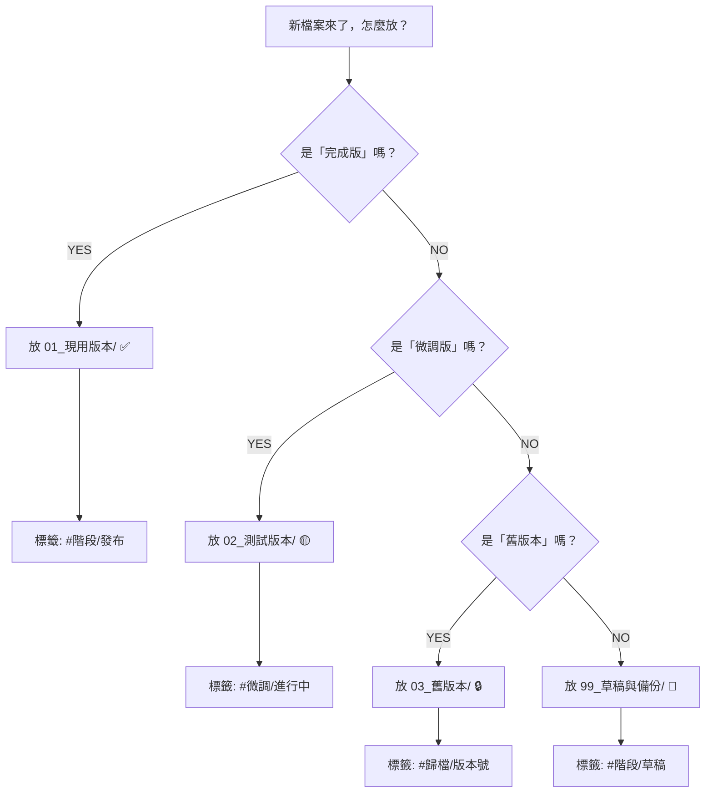

# 智研法學資料庫｜版本整理系統 v1.0

> [!warning] 舊版世代文件（2026-01）｜原置於 90_維運治理
> 本文件描述舊的「01_現用／02_測試／03_舊版本 + Bear/Perplexity/Obsidian」工作流，內文清單引用之檔名（如 `51_安全協議_SRP.txt`、`44_教學人格_TUTOR.txt`）在現行結構中已不存在。僅供歷史參考。

> [!abstract] 系統概述
> 這是一套專為**一人團隊**設計的檔案版本管理系統，旨在解決頻繁迭代過程中產生的版本混亂問題。它結合了結構化的文件夾、標籤系統與動態表格，實現快速整理與清晰檢索。

**用途**：一人團隊快速整理重複檔案
**適用平台**：GPT + Perplexity + Bear + Obsidian
**最後更新**：2026-01-18

---

## 核心架構：三層檔案管理系統

> [!tip] 核心概念
> 一人團隊的「三層檔案管理」哲學，確保工作流穩定、實驗安全與歷史可追溯。

層級 1：01_現用版本/      ← 「我現在正用的」
  特徵：乾淨、穩定、不亂動
  何時改：經過充分測試，確認可用
  檔案數：10～15 個
  
層級 2：02_測試版本/      ← 「我在嘗試改的」
  特徵：亂、多版本、經常變
  何時清理：改好了就拿回層級 1，沒改好的刪掉
  檔案數：2～5 個（進行中）
  
層級 3：03_舊版本/        ← 「以前用過的」
  特徵：歷史檔案，不改，只看
  何時清理：按年度歸檔，3 年後刪除
  檔案數：30～50 個（永遠保存）

### 整理原則
- ✅ 只在層級 2 做實驗
- ✅ 層級 1 永遠是「最新穩定版」
- ✅ 層級 3 永遠不動
- ✅ 每周移動 1～2 個檔案從「2→1」或「2→刪除」

---

## 文件夾結構

```
📁 智研法學資料庫/
│
├─ 📁 01_現用版本（當前工作）
│  ├─ 01_核心檔案/          ← 重要✅
│  ├─ 02_人格模組/          ← 重要✅
│  ├─ 03_策略模組/          ← 重要✅
│  ├─ 04_引用政策/          ← 重要✅
│  └─ 05_品質檢查/          ← 重要✅
│
├─ 📁 02_測試版本（微調中）
│  ├─ 微調_v2.0/
│  ├─ 微調_v2.1/
│  └─ README.txt           ← 寫明每版做了什麼
│
├─ 📁 03_舊版本（歸檔）
│  ├─ v1.0_舊/
│  ├─ v2.0_舊/
│  └─ README.txt
│
└─ 📁 99_草稿與備份
   ├─ 想法筆記/
   └─ 臨時檔案/
```

---

## 標籤系統 (Bear)

> [!note] 標籤使用指南
> 標籤是跨平台（Bear, Obsidian）檢索的關鍵。顏色用於快速識別優先級。

<details>
<summary>展開查看完整的 Bear 標籤系統</summary>

```
紅色標籤（最重要）
#智研/核心     ← 01_核心檔案/ 裡的所有檔
#智研/人格     ← 02_人格模組/ 裡的所有檔
#智研/策略     ← 03_策略模組/ 裡的所有檔

黃色標籤（進行中）
#微調/進行中    ← 現在在改的檔案
#測試/待驗證    ← 等著在 Perplexity 上測試

灰色標籤（舊版）
#歸檔/v1.0
#歸檔/v2.0
#歸檔/已棄用

階段標籤
#階段/草稿     ← 剛寫的想法
#階段/檢視     ← 想給 AI 看的版本
#階段/發布     ← 最終版，上傳到 Perplexity
```
</details>

---

## 動態檔案清單

### 一人團隊的「最小化版本表」
| 檔案名稱 | 位置 | 用途 | 標籤 | 上次修改 | 狀態 |
| :--- | :--- | :--- | :--- | :--- | :--- |
| 01_核心閘門_ZHIYAN_CORE_GATE.txt | 01_核心檔案 | 系統核心邏輯 | #智研/核心 | 2026-01-16 | ✅ 正用 |
| 10_主人格_MASTER.md | 01_核心檔案 | 主人格 | #智研/核心 | 2026-01-16 | ✅ 正用 |
| 11_啟動流程_BOOT.md | 01_核心檔案 | 路由邏輯 | #智研/核心 | 2026-01-16 | ✅ 正用 |
| 44_教學人格_TUTOR.txt | 02_人格模組 | 教學模式 | #智研/人格 | 2026-01-15 | ✅ 正用 |
| 51_安全協議_SRP.txt | 03_策略模組 | 安全規則 | #智研/策略 | 2026-01-16 | ✅ 正用 |
| 52_合約風險_CONTRACT_RISK.txt | 03_策略模組 | 風險評估 | #智研/策略 | 2026-01-15 | ✅ 正用 |
| 31_引用政策_CITATION_POLICY.md | 04_引用政策 | 引用規則 | #智研/引用 | 2026-01-16 | ✅ 正用 |
| 22_品質檢查_QC.md | 05_品質檢查 | 品檢流程 | #智研/檢查 | 2026-01-17 | ✅ 正用 |
| **微調版本** | **02_測試版本** | | | | |
| 51_SRP_v2.1_test.txt | 02_測試版本/微調_v2.1 | 測試中... | #微調/進行中 | 2026-01-18 | 🟡 測試中 |
| **舊版** | **03_舊版本** | | | | |
| 01_CORE_GATE_v1.0.txt | 03_舊版本/v1.0_舊 | 備份用 | #歸檔/v1.0 | 2025-12-10 | 🔒 舊版 |

---

## 操作流程與決策樹

### 快速決策樹（遇到檔案時直接用）



<details>
<summary>展開查看「修改既有檔案」的流程</summary>

```
【想改一個既有檔案，怎麼做？】

  檔案在 01_現用版本/ 嗎？
  ├─ YES → 複製到 02_測試版本/，改副檔名（加 _test）
  │   └─ 在 02 裡面改
  │   └─ 改好後，測試通過
  │   └─ 複製回 01_現用版本/（覆蓋舊版）
  │   └─ 刪除 02 裡的測試版
  │
  └─ NO（在 02_測試版本/） → 直接在 02 改
      └─ 改好測試通過 → 移到 01
      └─ 改不好或放棄 → 刪除
```
</details>

> [!warning] 刪除保護機制
> **想刪一個檔案，確定嗎？**
> 1.  先移到 `03_舊版本/`（不是完全刪除！）
> 2.  等 1 個月，確定真的不用了
> 3.  才能完全刪除
> *（為什麼？防止誤刪重要檔案）*

---

## 週期性維護計劃

### 一週工作流
- **周一～周五：工作日**
    - 日常工作：在 GPT 上迭代新想法，修改檔案（放在 `02_測試版本/`）。
    - 黃金法則：不動 `01_現用版本/` 和 `03_舊版本/`。
- **周六：測試日**
    - 在 Perplexity 上驗證 `02_測試版本/` 中的檔案。
- **周日：整理日（5分鐘）**

### 每週日清理步驟（5分鐘快速整理）
<details>
<summary>展開查看詳細清理步驟</summary>

```
步驟 1：在Bear上檢查所有標籤
├─ 標籤：#微調/進行中 有多少？
├─ 標籤：#階段/草稿 有多少？
└─ 標籤：#歸檔/已棄用 有多少？

步驟 2：問自己
├─ 「這個微調版本還要嗎？」
│  YES → 改標籤為 #階段/檢視（下周上傳）
│  NO  → 刪除或移到 03_舊版本/
│
└─ 「這個草稿還要改嗎？」
   YES → 加到下週計劃
   NO  → 移到 99_草稿與備份/

步驟 3：移動檔案
├─ 完成的版本 → 01_現用版本/ （改標籤 #階段/發布）
├─ 弄廢的版本 → 03_舊版本/ （改標籤 #歸檔/已棄用）
└─ 待測試的版本 → 02_測試版本/ （標籤保持 #微調/進行中）

步驟 4：更新「檔案清單表」
└─ 在這個表格裡，把「狀態」和「上次修改」改新日期
```
</details>

### 檢查清單（周日整理用）
- [ ] `02_測試版本` 裡有多少檔？ 答：___ 個
- [ ] 這些檔有沒有可以「移回 01」的？ 答：有 ___ 個可以移
- [ ] 有沒有「改不好要放棄」的檔？ 答：有 ___ 個要刪或移到 03
- [ ] `01_現用版本` 有沒有被誤改？ 答：沒有
- [ ] 更新了「檔案清單表」沒？ 答：有
- [ ] Bear 標籤有沒有跟著改？ 答：有
**總耗時**：約 5 分鐘

---

## 模板與協作工具

### README 範本
<details>
<summary>展開查看 `02_測試版本/README.txt` 範例</summary>

```
📄 02_測試版本 — 當前微調進度
更新日期：2026-01-18
目前版本：v2.1

【這個資料夾裡有什麼】
- 51_SRP_v2.1_test.txt       ← 安全協議，修改了「風險判斷邏輯」
- 44_TUTOR_draft.txt         ← 教學人格草稿，等待設計確認

【為什麼在測試中】
51_SRP_v2.1：
  修改內容：新增「高風險自動升級」機制
  何時完成：預計 2026-01-20
  下一步：在 Perplexity 上試用 3 個案例

44_TUTOR_draft：
  修改內容：調整教學人格的語氣
  何時完成：待 GPT 反饋
  下一步：GPT 檢查語氣是否恰當

【什麼時候會被刪掉】
✅ 測試通過 + 上傳到 01_現用版本 後，本檔刪除
❌ 測試失敗，觀點回退 v1.0 後，本檔刪除
```
</details>

### 給 GPT 的提示詞範本
> [!tip] 高效協作提示
> 使用標準化提示詞，讓 GPT 更好地理解你的上下文和需求。

```markdown
我是一人團隊，做 AI 法學資料庫。
我的檔案結構是這樣的：

【01_現用版本/】← 穩定、正在用
  - 核心檔案、人格模組、策略模組
  
【02_測試版本/】← 微調中、多版本
  - 新想法都在這測試

【03_舊版本/】← 備份、不改

現在我想改「[檔案名]」，要做的是「[改什麼]」。

你幫我：
1. 檢查邏輯有沒有漏洞
2. 給出改進建議
3. 列出改完後的「驗證清單」（怎麼知道改對了）

謝謝！
```

---

## 戰略摘要

> [!abstract] 關鍵結論
> 本系統通過**物理隔離（三層文件夾）**、**邏輯標記（標籤系統）** 和**動態追蹤（檔案清單表）**，為一人團隊構建了一個免於混亂、安全迭代的知識工作環境。

### 核心風險點
1.  **目錄漂移**：若未嚴格遵守「只在02層修改」的規則，可能污染穩定版本。
2.  **標籤不一致**：檔案移動後，若忘記更新Bear標籤，會導致檢索失效。
3.  **歸檔癱瘓**：過度備份導致 `03_舊版本/` 膨脹，應堅持「3年後刪除」原則。

### 下一步行動
- [ ] 立即套用：按照「立即可做」清單初始化你的文件夾結構。
- [ ] 建立習慣：將「週日5分鐘整理」設為每週必做事項。
- [ ] 優化迭代：在實際使用中，將遇到的問題反饋並更新本系統文檔。

---

## 可視化與動態檢索建議

### Canvas 白板構想
建議在 Obsidian Canvas 中創建一個視覺化工作流：
1.  **三個主要節點**：分別代表 `01_現用版本`、`02_測試版本`、`03_舊版本`。
2.  **連接線與流動**：用箭頭表示檔案從 `02` → `01`（發布）或 `02` → `03`（歸檔）的移動路徑。
3.  **嵌入筆記**：將「檔案清單表」和「快速決策樹」作為卡片嵌入，形成中央控制面板。

### Kanban 流程轉化
可在 Obsidian 中使用 Kanban 插件管理檔案狀態：
- **待測試**：對應 `02_測試版本` 中的檔案。
- **驗證中**：對應標籤 `#測試/待驗證`，正在 Perplexity 測試。
- **已發布**：對應已移回 `01_現用版本` 的檔案。
- **已歸檔**：對應移入 `03_舊版本` 的檔案。

### Dataview 動態查詢
利用以下代碼塊，可以在 Obsidian 中自動聚合所有相關筆記。

```dataview
TABLE 用途, 狀態, file.ctime as 創建時間
FROM #智研/核心 OR #智研/人格 OR #智研/策略
WHERE file.name != this.file.name
SORT file.mtime DESC
```

```dataview
TASK
FROM #微調/進行中 OR #測試/待驗證
WHERE !completed
GROUP BY file.folder
```

---

#標籤 #個人知識管理 #工作流優化 #版本控制

## 📋 相關文件

- [[90_檔案清單表_v2026.2.28|90_檔案清單表_v2026.2.28]]
- [[91_文檔淨化引擎_v3.0.3|92_文檔淨化引擎_v3.0.3]]
- [[92_文檔淨化引擎使用手冊_v1.0.0|93_文檔淨化引擎使用手冊_v1.0.0]]
- [[88_一人團隊優化路線圖_v1.0.0_legacy|🎯 一人團隊優化方向 — 實戰路線圖]]
- [[93_冒煙測試_SMOKE_TESTS_v1.0.0|95_冒煙測試_SMOKE_TESTS_v1.0.0]]
- [[94_匯出對照_EXPORT_MAP_v1.0.0|96_匯出對照_EXPORT_MAP_v1.0.0]]
- [[89_檔案架構優化方案_v1.0.0_legacy|法務智研系統檔案架構優化方案]]
- [[95_功能驗收矩陣_FUNCTION_ACCEPTANCE_v1.0.0|98_功能驗收矩陣_FUNCTION_ACCEPTANCE_v1.0.0]]
- [[96_上線自測報告_SELF_TEST_REPORT_v1.0.0|99_上線自測報告_SELF_TEST_REPORT_v1.0.0]]
- [[86_技術架構與操作手冊_v1.3_reference|Legal AI System v1.3 - 技術架構與操作手冊]]
