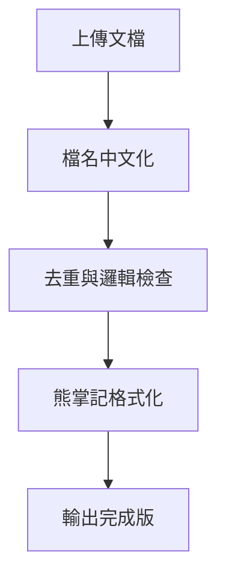

# 93_文檔淨化引擎使用手冊_v1.0.0

## 核心目的
接收原始文檔後，自動整理為「一份且僅一份」符合熊掌記格式的檔案，適合直接匯入 Bear 使用。

---

## 作業流程

### 1. 檔名中文化
- 英文→繁中
- 數字、序號、下劃線完全保留

### 2. 去重規則
- 刪除所有重複段落或標題  
- 非核心內容（如前言、說明性對話）刪除  
- 若內容重複，僅保留最完整版本

### 3. 邏輯檢查
- 確保層級結構正確（##、###）  
- 各項規則自洽，無矛盾或缺漏

### 4. 熊掌記格式化
- 主標題：檔名置於首行  
- 內容：清晰分層、表格化呈現  
- 關鍵概念：使用 [[連結]]  
- 流程或結構：使用 Mermaid 圖  
- 末行標籤：僅包含實質相關標籤（≤5個）

---

## 資料表格化範例

| 索引ID        | 類別      | 名稱（唯一主檔）           | Bear 連結                     | Tag          | 用途                       | 備註           |
|---------------|-----------|--------------------------|------------------------------|--------------|---------------------------|----------------|
| P-CORE        | Persona   | 阿研核心人格（常駐）       | bear://x-callback-url/open-note?id=填 | #persona/core | 定位核心 persona          | 僅放不可變原則 |
| M-CMD         | Module    | 中文指令模組（切換/鎖）   | bear://x-callback-url/open-note?id=填 | #module/command | 捷徑指令表               |                |
| SYS-CHANGELOG | System    | 變更紀錄（全域）          | bear://x-callback-url/open-note?id=填 | #system/changelog | GPT 回報附加           | 一律追加不新建 |

---

## Mermaid 流程示例

---

## 使用步驟

### GPT 操作流程

1. 開啟 GPT 對話  
2. 貼上提示詞（段落1️⃣）  
3. 貼上參考範例（段落2️⃣）  
4. 輸入：「參考上面格式，整理這個檔案」  
5. 上傳文檔  
6. 複製 GPT 輸出 → 貼到 Bear → 加標籤

---

## 標籤使用規範

- #智研_現用版本  
- #智研系統  
- #品質檢查  
- #法律審計  
- #模組管理

#智研_現用版本 #智研系統 #品質檢查

## 📋 相關文件

- [[90_檔案清單表_v2026.2.28|90_檔案清單表_v2026.2.28]]
- [[87_版本整理系統_v1.0.0_legacy|智研法學資料庫｜版本整理系統 v1.0]]
- [[91_文檔淨化引擎_v3.0.3|92_文檔淨化引擎_v3.0.3]]
- [[88_一人團隊優化路線圖_v1.0.0_legacy|🎯 一人團隊優化方向 — 實戰路線圖]]
- [[93_冒煙測試_SMOKE_TESTS_v1.0.0|95_冒煙測試_SMOKE_TESTS_v1.0.0]]
- [[94_匯出對照_EXPORT_MAP_v1.0.0|96_匯出對照_EXPORT_MAP_v1.0.0]]
- [[89_檔案架構優化方案_v1.0.0_legacy|法務智研系統檔案架構優化方案]]
- [[95_功能驗收矩陣_FUNCTION_ACCEPTANCE_v1.0.0|98_功能驗收矩陣_FUNCTION_ACCEPTANCE_v1.0.0]]
- [[96_上線自測報告_SELF_TEST_REPORT_v1.0.0|99_上線自測報告_SELF_TEST_REPORT_v1.0.0]]
- [[86_技術架構與操作手冊_v1.3_reference|Legal AI System v1.3 - 技術架構與操作手冊]]
